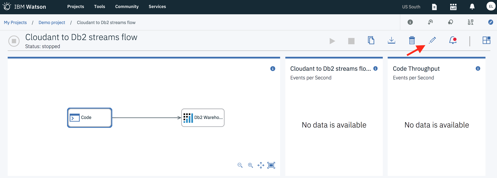
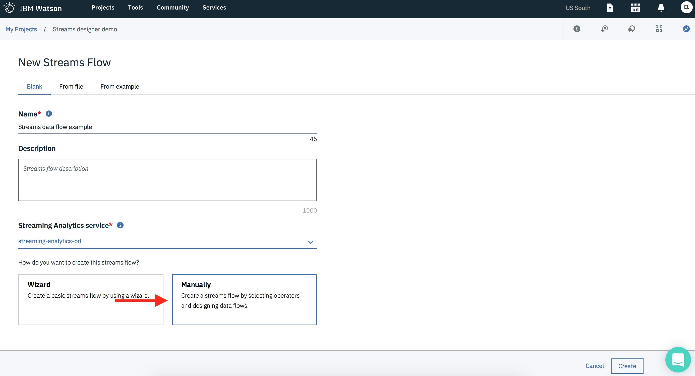
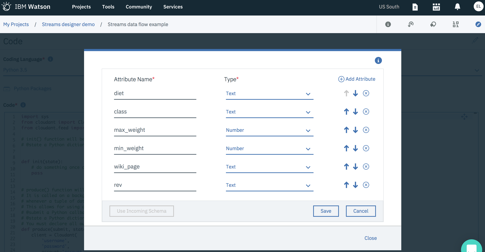
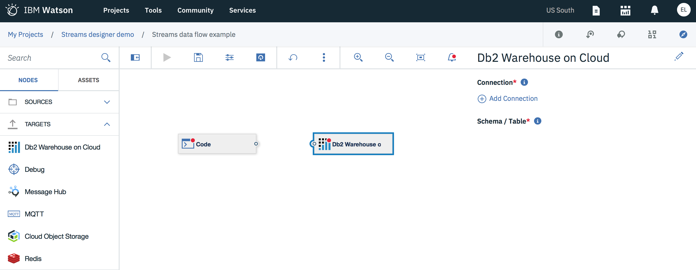
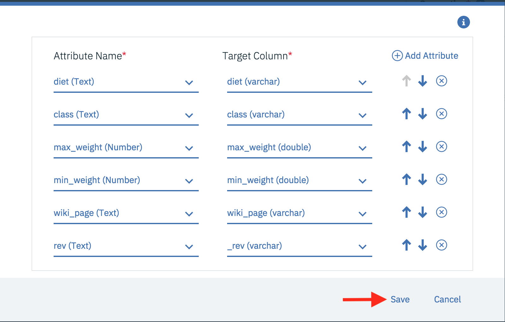

# Simple load from Cloudant to Db2 in `Streams Designer (Beta)`
This tutorial is an introduction on loading Cloudant documents and saving that data into Db2 within Streams Designer.
In this tutorial you will:

1. Set up IBM services: Cloudant, Streaming Analytics, Watson Studio, and Db2 Warehouse on Cloud.
1. Create a Python `Code` operator that will load Cloudant documents from the `_changes` endpoint.
1. Edit the output schema for the Python `Code` operator.
1. Create a Db2 operator and add the connection details.
1. Map the `Code` operator schema with the target columns in the Db2 table.
1. Save and run the streams flow.

**N.B. This is an example only intended as a _starting point_ for using IBM Streams Designer to extract data from Cloudant and insert into Db2 Warehouse on Cloud. It is _not_ intended as a drop-in replacement for the deprecated Cloudant warehouse integration. In particular this example does not create or alter Db2 tables or handle document deletion.**

## Before you begin 

These are the IBM Bluemix services required to run this tutorial:
1. [Cloudant](https://console.bluemix.net/catalog/services/cloudant-nosql-db)
1. [Db2 Warehouse on Cloud](https://console.bluemix.net/catalog/services/dashdb)
1. [Watson Studio](https://datascience.ibm.com)

# Setting up IBM Cloud services

## Cloudant
1. [Create an IBM Cloudant](../cloudant/create.md) instance.
1. [Replicate the tutorial data](../cloudant/replicate.md).

## Streaming Analytics
1. [Create an IBM Streaming Analytics](../streaming-analytics/create.md) instance.

## Watson Studio
1. [Creating an IBM Watson Studio](../watson-studio/create.md) instance.

## Db2 Warehouse on Cloud
1. [Create an IBM Db2 Warehouse on Cloud](../db2/create.md) instance.
1. [Create a Db2 table to house the data](../db2/animaldb_table.md).

## Create a Watson Studio project
1. In the Watson Studio instance, open the Watson Studio app by pressing `Get Started`.

1. Create a new project by selecting `New Project`.

1. Select the `Streams Designer` tile and press OK.
1. On the **New project** screen, add a name and optional description for the project, then press **Create**.<br/>
**Note**: The previously created Streaming Analytics service should be pre-selected as seen in the screenshot.  If the 
Cloud Object Storage instance was not created beforehand, you will have the option of adding one.
 

## Option 1: Import the Streams flow file
1. Create a new Streams flow under the `Add to project` drop-down list.

1. On the **New Streams Flow** screen, Select **From file**.  Drag and drop [Cloudant_to_Db2_streams_flow.stp](Cloudant_to_Db2_streams_flow.stp)
under the **File** section.
The Streaming Analytics service drop-down box should already be filled in.  Press **Create**.

1. Edit the streams flow by clicking the pencil icon.

1. Select the Code operator to open the code editor in the right pane. Replace the lines with `username`, `password`, and
`account` with your Cloudant credentials.

1. [Setup the Db2 operator.](#setup-the-db2-operator)

## Option 2: Create a new Streams flow
1. Create a new Streams flow under the `Add to project` drop-down list.

1. On the **New Streams Flow** screen, add a name and optional description for the project. 
The Streaming Analytics service drop-down box should already be filled in.  
Select the **Manually** box, then press **Create**.


The first node we'll create is a Python node for loading documents from Cloudant.
1. Drag and drop the `Code` operator under **Sources** on to the canvas.
1. Select the `Code` operator and a right pane will open for editing the code.

1. Select `Python 3.5` as the coding language and replace what's existing with the code below.<br/>
   **Note:** Add your Cloudant credentials as parameters in the Cloudant initializer `client = Cloudant(...)`.
    ```python
    from cloudant import Cloudant
        
    # init() function will be called once on pipeline initialization
    # @state a Python dictionary object for keeping state. The state object is passed to the produce function
    
    
    def init(state):
        # do something once on pipeline initialization and save in the state object
        pass
    
    
    # produce() function will be called when the job starts to run.
    # It is called on a background thread, and it will typically invoke the 'submit()' callback
    # whenever a tuple of data is ready to be emitted from this operator.
    # This allows for using asynchronous data services as well as synchronous data generation or retrieval.
    # @submit a Python callback function that takes one argument: a dictionary representing a single tuple.
    # @state a Python dictionary object for keeping state
    # You must declare all output attributes in the Edit Schema window.
    def produce(submit, state):
        # Replace with your Cloudant credentials
        # Note: In general, 'account' is the username.
        client = Cloudant(
            'username',
            'password',
            account='account',
            connect=True
        )
        db = client['animaldb']
        feed = db.changes(feed='continuous', include_docs=True)
        for change in feed:
           doc = change['doc']
           # Submit the Cloudant doc in each iteration:
           submit(doc)
    ```
1. Select the `Edit Output Schema` below the code editor.
1. Add the following attribute names and their types using the **Add Attribute** button.
   Press **Save** then **Close** when finished.

    Name | Type
    --- | --- 
    \_id | Text
    \_rev | Text
    \_deleted | Boolean
    wiki_page | Text
    min_weight | Number
    max_weight | Number
    min_length | Number
    max_length | Number
    latin_name | Text
    class | Text
    diet | Text

    

1. Select the floppy disk icon in the Stream Designer toolbar to save the flow.
1. Drag and drop the Db2 Warehouse on Cloud operator under **Targets** on to the canvas.

## Setup the Db2 operator
1. Select the Db2 Warehouse on Cloud operator and a right pane will open for adding connection details.

1. Click `Add Connection` and select the Db2 Warehouse on Cloud instance that was previously created.
Select **Create** to finish.<br/>
**Note:** If `Your service instances in IBM Cloud` is empty, you can [grab the JDBC connection string](../db2/connection_details.md)
and create a connection manually. 

1. Click on the icon under **Schema/Table** to select the Db2 table.
1. Select your schema and `ANIMALS` table, then press **Select**.

1. Link the two operators together by dragging your mouse cursor from the output port of the `Code` operator to the input 
port of the Db2 operator.

1. Select **Map Schema** in the Db2 operator's right pane.

1. Assign the attributes previously created in the `Code` operator to it's equivalent Db2 target column, and then press **Save**.


## Run the Streams flow
1. Press the play icon in the Stream Designer toolbar to save and run the streams flow.

1. The Status indicator in the Metrics page will change from _stopped_ to _starting_, and then to _running_.

1. [View the extracted data imported into the Db2 table](../db2/view_data.md).


